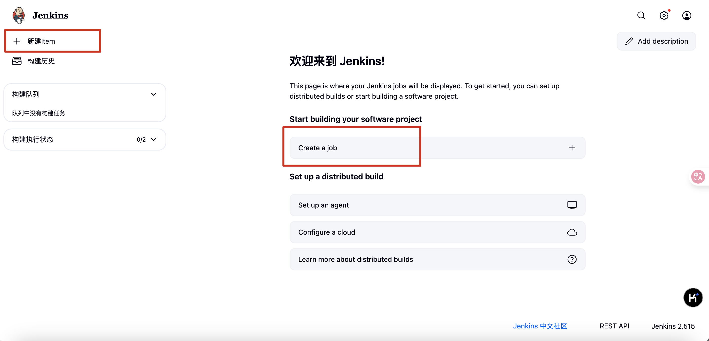
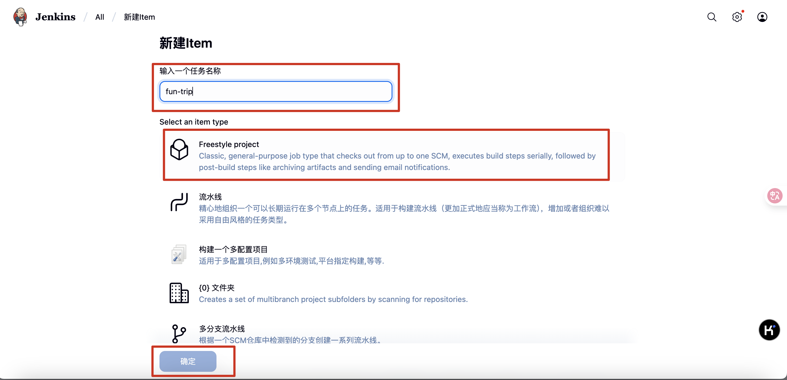
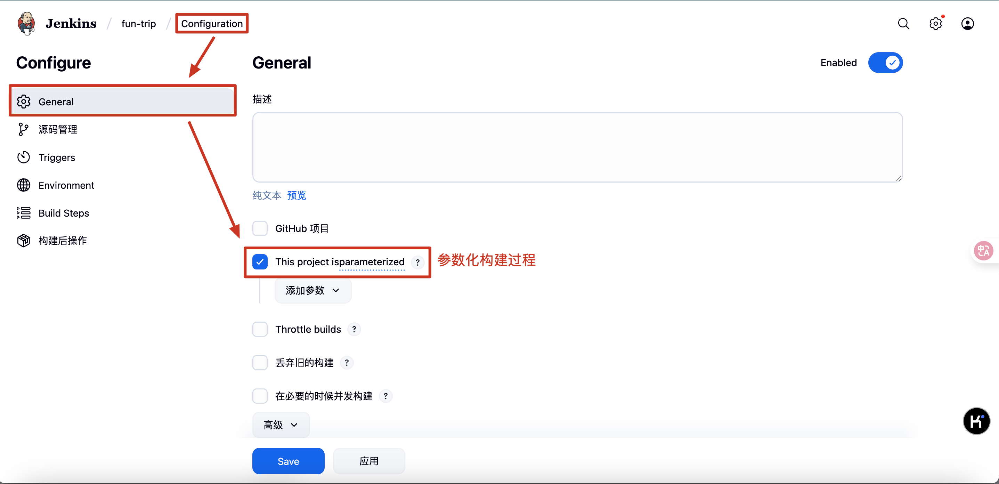
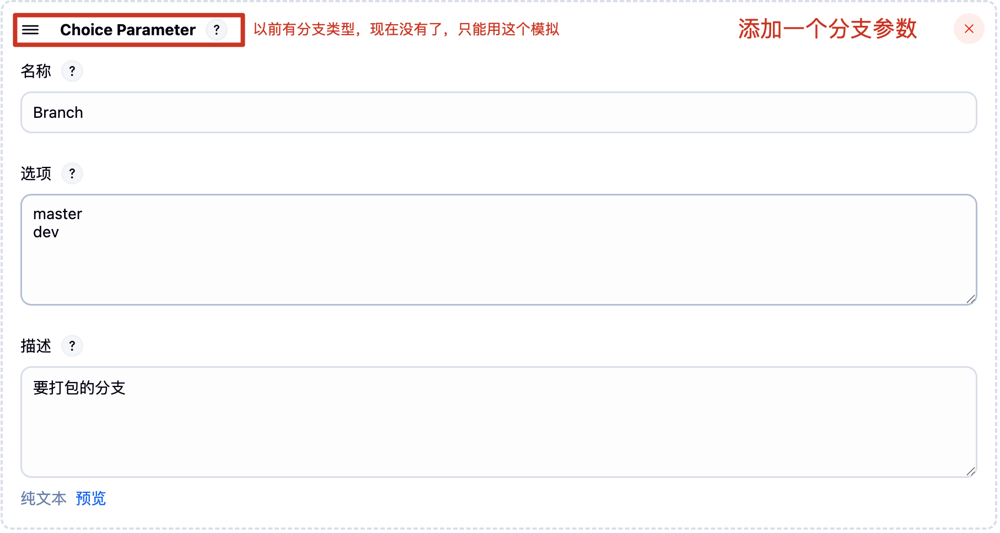
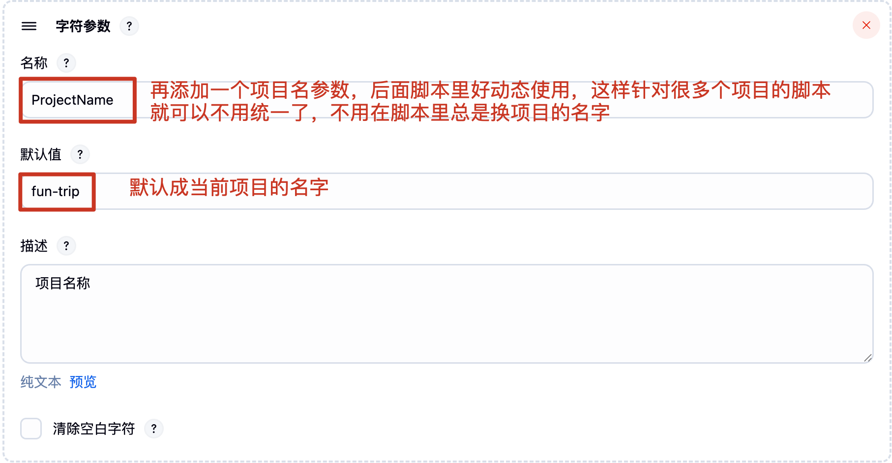
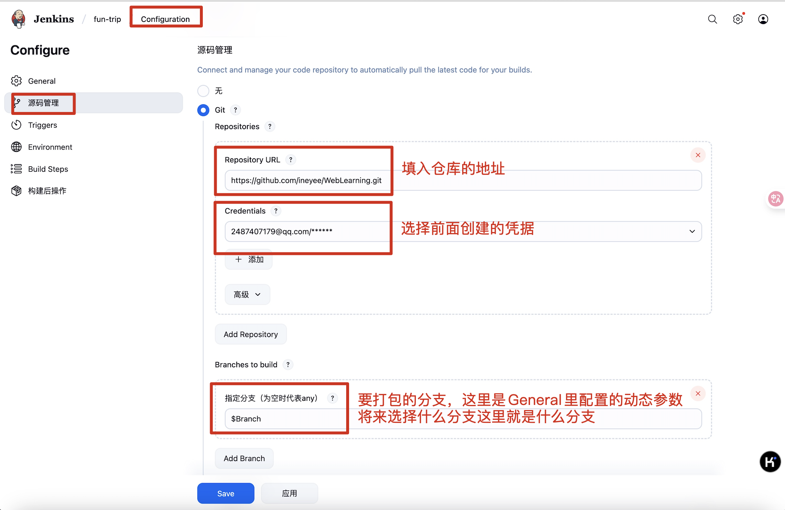
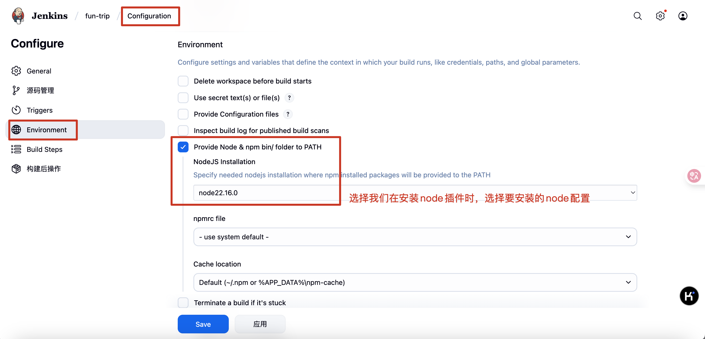
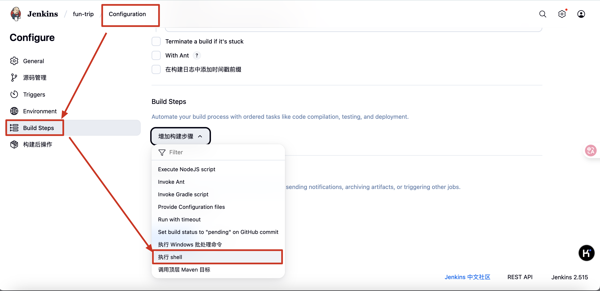
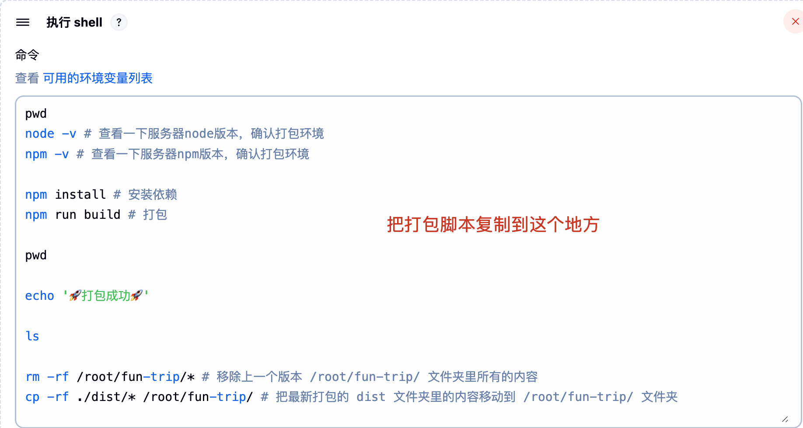

## 一、打包
* cd到项目根目录
* 执行“npm run build”命令即可，webpack就会给我们把项目打包在根目录下的dist文件夹里了，当然我们可以把dist改成我们项目的名字（手动修改或者webpack打包配置修改都行）

## 二、部署

#### 1、购买云服务器（这里以阿里云为例）

###### 1.1 注册阿里云账号
在阿里云官网注册即可，https://aliyun.com/

###### 1.2 购买云服务器
* 阿里云首页
* 控制台
* 搜索云服务器ECS，点进去
* 创建实例（一个实例对应一个服务器）
  * 基础配置
    * 付费模式：长期使用选包年包月，学习练习选按量付费
    * 地域及可用区：阿里的服务器放在很多不同的地方，我们要选择离用户近的那个地方以便用户访问起来更快
    * 实例规格：服务器的核数和内存要多少，按自己的需求选择相应性能的规格
    * 镜像操作系统：服务器一般安装的都是Linux操作系统，公司里我们一般选择的是Linux操作系统的CentOS版本
    * 存储：服务器的硬盘要多大，按自己的需求选择相应的存储容量
  * 网络和安全组：选择默认的或之前的安全组或新建一个安全组都行，主要决定了哪些端口号可以被访问，比如安全组要添加上80端口和443端口，因为http请求默认是80端口，https请求默认是443端口，所以我们要添加上这两个端口，这样我们的服务器才能被外网访问，又比如MySQL数据库默认的端口是3306端口，所以我们也要添加上这个端口，否则我们的数据库也不能被外网访问
  * 密钥对或密码：选择自定义密码，输入密码，就是root这个用户的密码，将来我们可以通过这个账号和密码来访问服务器
  
#### 2、配置云服务器，给服务器安装nginx

###### 2.1 先把我们的电脑连接到服务器
* 阿里云的实例（即服务器）详情页面里有个“远程连接”，点击它即可连接上服务器

###### 2.2 在阿里云给我们打开的终端里给服务器安装nginx
我们要用nginx在监听来自客户端的访问，并再给客户端返回一个页面，比如默认情况下nginx在监听80端口，并给客户端返回“/usr/share/nginx/html”对应的页面，下面我们就会看到。而后面我们在部署node项目时就可以不安装nginx，因为我们会安装nodejs，nodejs本身就可以监听端口，我们就不需要额外用nginx来监听端口了
* 执行“dnf install nginx”命令安装nginx
* 可以通过“nginx -v”或“nginx --version”来查看所安装nginx的版本

###### 2.3 启动nginx
* 执行“systemctl start nginx”命令来启动nginx
* 然后我们可以执行”systemctl status nginx“命令来查看nginx的运行状态是否成功启动，如果看到active(running)就代表启动成功了
* 此外我们还可以执行”systemctl enable nginx“命令来让服务器重启时自动启动nginx，免得每次重启系统还得我们主动执行命令来启动nginx

###### 2.4 配置nginx
这里主要配置nginx的用户和默认访问目录
* 找到etc文件夹(和root文件夹平级的)下的nginx文件夹，找到nginx.config文件，打开它
* 把文件里的“user nginx;”改成“user root;”让nginx具备root权限，到时候nginx访问我们服务器上的资源时就是以root权限访问了
* 找到下面的server，可见nginx默认监听的是80端口，当nginx监听到80端口有访问时会把root对应的页面给返回来——即“/usr/share/nginx/html”这个页面、这个页面是nginx在usr目录下内置的一个页面，我们当然不是给用户返回这个页面，所以要把它注释掉，然后去location那里配置针对每个项目我们想返回给用户的界面即可
```默认配置
server {
        listen       80;
        listen       [::]:80;
        server_name  _;
        root         /usr/share/nginx/html;

        # Load configuration files for the default server block.
        include /etc/nginx/default.d/*.conf;

        error_page 404 /404.html;
        location = /404.html {
        }

        error_page 500 502 503 504 /50x.html;
        location = /50x.html {
        }
    }
```
```修改后的配置
server {
    listen       80 default_server;
    listen       [::]:80 default_server;
    server_name  _;
    # 这个是用户访问根路径、即用户访问 http://118.25.70.197 时返回给用户的页面
    # root         /usr/share/nginx/html;

    # Load configuration files for the default server block.
    include /etc/nginx/default.d/*.conf;

    # 这里跟上面 root 的写法不同，但作用相同，这里我们设计用户访问 http://118.25.70.197 时，我们给用户返回我们主要的项目 fun-trip
    location / {
        root /root/fun-trip/;
        index index.html;
    }

    # 项目1: fun-trip - 通过 http://118.25.70.197/fun-trip 访问
    location /fun-trip {
        # alias 的含义是：当用户访问 http://118.25.70.197/fun-trip 时，nginx 会先找到 /root/fun-trip/ 目录
        alias /root/fun-trip/;
        # index 的含义是：然后 nginx 会找到该目录下的 index.html 页面返回给用户
        index index.html;
        # try_files 是为了确保前端路由能正常工作
        try_files $uri $uri/ /fun-trip/index.html;
    }

    # 项目2: fun-car - 通过 http://118.25.70.197/fun-car 访问
    location /fun-car {
        alias /root/fun-car/;
        index index.html;
        try_files $uri $uri/ /fun-car/index.html;
    }

    error_page 404 /404.html;
        location = /40x.html {
    }

    error_page 500 502 503 504 /50x.html;
        location = /50x.html {
    }
}
```
* 记得cmd + s保存更改
* 修改了nginx的配置后，需要重启一下nginx，执行“systemctl restart nginx”命令来重启nginx


#### 3、把我们的项目部署到服务器

###### 3.1 手动部署
* VSCode里安装”Remote -SSH“插件（也可以直接在阿里云的那个连接远程里做，那个里面也能打开文件夹）
* 左侧侧边栏选中该插件
* SSH右侧选择新建远程
* 在弹窗里输入“ssh root@服务器的公网IP”，回车来新建远程
* 选择“/User/xxx/.ssh/config”配置文件
* 左侧SSH下就有我们的远程服务器了
* 选中远程服务器，右键连接，输入root用户的密码即可发起连接
* 连接成功后，选中左侧侧边栏的文件，发现里面会提示“已连接到远程”
* 然后我们选择“打开文件夹”来打开远程服务器上的文件夹，默认会帮我们打开远程服务器的root文件夹，这样远程服务器的root文件夹就展示在VSCode里了
* 直接把我们的项目拖进root文件夹里，这样远程服务器上就有我们的项目了
* 去nginx.config文件里查看下我们配置的访问路径对不对，没问题的话去请求页面试试吧

###### 3.2 Jenkins自动部署

###### 3.2.1 在阿里云给我们打开的终端里给服务器安装Java环境

Jenkins本身是依赖Java的，所以我们需要先安装Java环境：

* 执行“dnf search java”命令来查看支持的java版本，选择一个版本比如“java-21-openjdk”
* 执行“dnf install java-21-openjdk”命令安装java
* 可以通过“java --version”来查看所安装java的版本

###### 3.2.2 在阿里云给我们打开的终端里给服务器安装Jenkins及其插件

因为Jenkins本身是没有在dnf的软件仓库包中的，所以我们需要通过Jenkins仓库来安装：

* wget是Linux中下载文件的一个工具，-O表示输出到某个文件夹并且命名为什么文件
* rpm：是Linux下一个软件包管理器

```shell
# 把Jenkins仓库文件先下载到服务器的某个目录下
wget –O /etc/yum.repos.d/jenkins.repo http://pkg.jenkins-ci.org/redhat-stable/jenkins.repo

# 导入GPG密钥以确保安装的jenkins软件合法
sudo rpm --import https://pkg.jenkins.io/redhat-stable/jenkins.io.key
# 或者
rpm --import http://pkg.jenkins-ci.org/redhat/jenkins-ci.org.key
```

直接找到“/etc/yum.repos.d/jenkins.repo”这个仓库文件或通过“vim /etc/yum.repos.d/jenkins.repo”把下面的内容复制进仓库文件里

```
[jenkins]

name=Jenkins-stable

baseurl=http://pkg.jenkins.io/redhat

gpgcheck=1
```

安装Jenkins

```shell
dnf install jenkins # --nogpgcheck(可以不加)
```

启动Jenkins的服务：

```shell
systemctl start jenkins
systemctl status jenkins
systemctl enable jenkins
```

因为Jenkins默认使用服务器的8080端口提供服务，所以需要在云服务器的网络和安全组里添加8080端口。添加好端口后，此时去浏览器里通过云服务器的ip地址加端口号就能访问到jenkins的服务了，比如：http://118.25.70.197:8080

访问地址后，Jenkins会提示我们登录，并且告诉我们admin用户的初始密码存储在云服务器上的哪个文件里，我们可以找到这个文件拿到密码，或者通过下面的cat命令直接读取文件拿到密码，然后登录进去：

```shell
cat /var/lib/jenkins/secrets/initialAdminPassword # 读取文件里的密码
```

登录成功后选择“安装推荐的插件”，这样一来jenkins在执行大多数操作时所需要的插件就被安装好了

当然也有一些插件需要我们后续手动安装——比如node，一会进去之后记得手动安装一下node插件：【管理jenkins】-【插件】-【可用的插件】-【搜索node】-【安装nodejs】。安装好nodejs插件之后，还得去【全局工具配置】-【NodeJS 安装】-【新增NodeJS】-【别名随便取一个比如叫node】-【要安装的node版本号最好跟你电脑上开发用的那个版本号一致，不然可能因为api不一致，本地代码能跑服务器上就不能跑了】-【其他的不用管】-【保存】（这里其实是让jenkins 给服务器安装一个node，如果我们服务器上已经安装相同版本的话就不用安装了）

插件安装成功后，jenkins会提示我们创建管理员用户以便后续使用，因为刚才默认的admin用户密码太难记了，所以我们一般都是用自己创建的用户来使用jenkins，按提示创建用户并登录进去即可

###### 3.2.3 在阿里云给我们打开的终端里配置jenkins

执行下面的命令让jenkins具备root权限，到时候jenkins访问我们服务器上的资源时就是以root权限访问了，执行完后记得重启一下jenkins

```shell
sudo usermod -a -G root jenkins
systemctl restart jenkins
```

如果执行了上面的命令，在打包时还是遇到无法删除原项目的权限问题，可以再执行下下面的命令，执行完后记得重启一下jenkins

```shell
sudo chown -R jenkins /root/fun-trip #替换成项目的真实目录
systemctl restart jenkins
```

###### 3.2.4 在阿里云给我们打开的终端里给服务器安装git
因为将来jenkins要通过git来拉取我们提交的代码到服务器上
* 执行“dnf install git”命令安装git
* 可以通过“git -v”或“git --version”来查看所安装nginx的版本

###### 3.2.5 新建打包任务、完成自动打包与部署

* `新建任务`

新建 item 和 create a job 是一样的，都是新建一个任务



输入任务名、选择自定义打包流程、点击确定



* `General -> 参数化构建过程 -> 添加参数`







* `源码管理`

先创建一个凭据：【管理jenkins】-【凭据管理】-【System】-【全局凭据】-【添加凭据】- 输入你git仓库的账号和密码



* `构建环境`



* `Build Steps`




打包脚本
```shell
pwd # 查看当前所在目录，确保打包的项目没错

node -v # 查看一下服务器node版本，确认打包环境
npm -v # 查看一下服务器npm版本，确认打包环境

npm install # 安装依赖
npm run build # 打包

echo '🚀打包成功🚀'

ls # 查看当前目录有没有多出来打包产物的目录

rm -rf /root/$ProjectName/* # 移除上一个版本 /root/fun-trip/ 文件夹里所有的内容
cp -rf ./dist/* /root/$ProjectName/ # 把最新打包的 dist 文件夹里的内容移动到 /root/fun-trip/ 文件夹
```