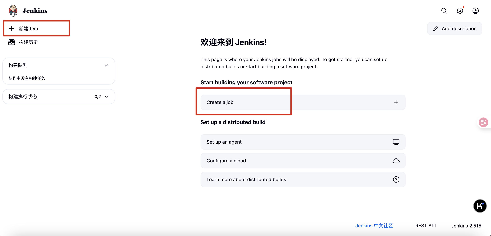
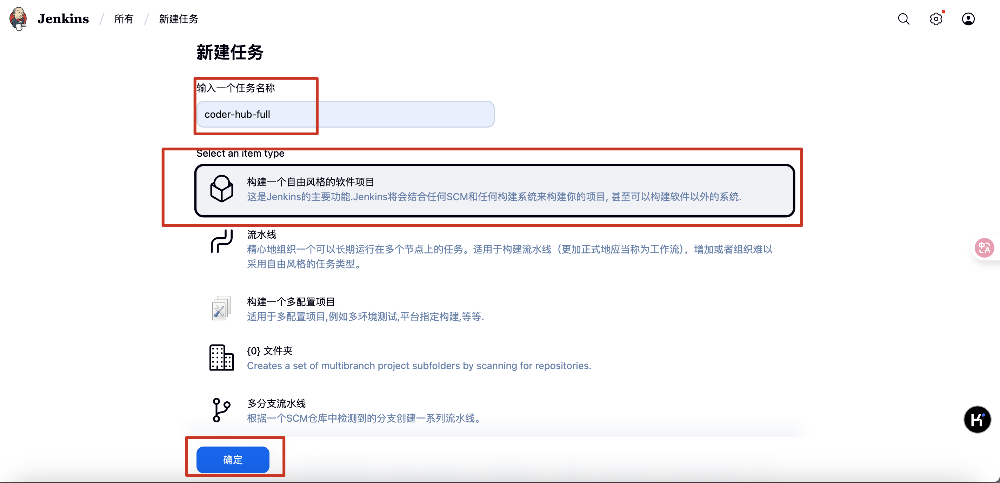
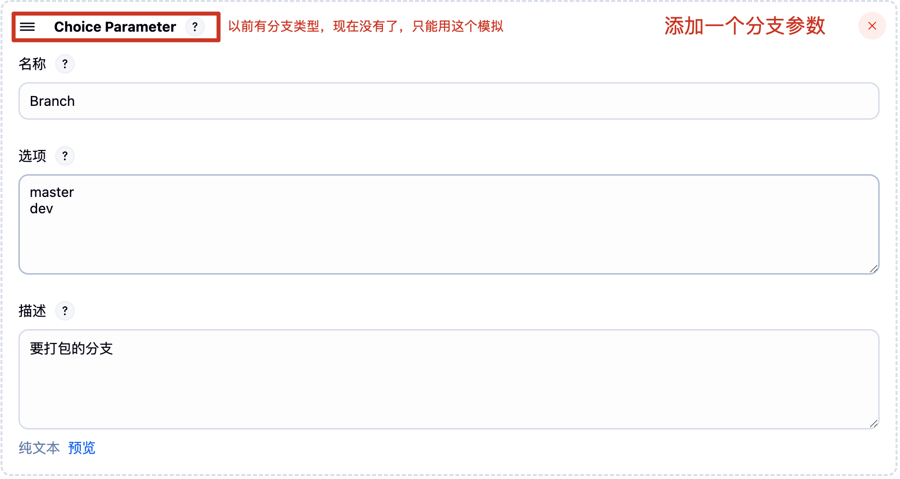
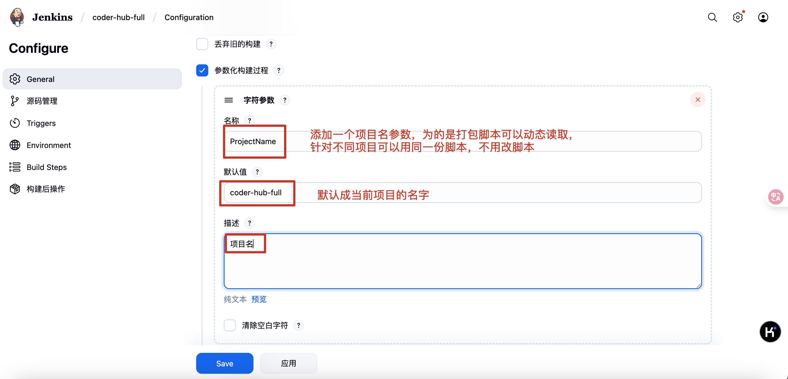
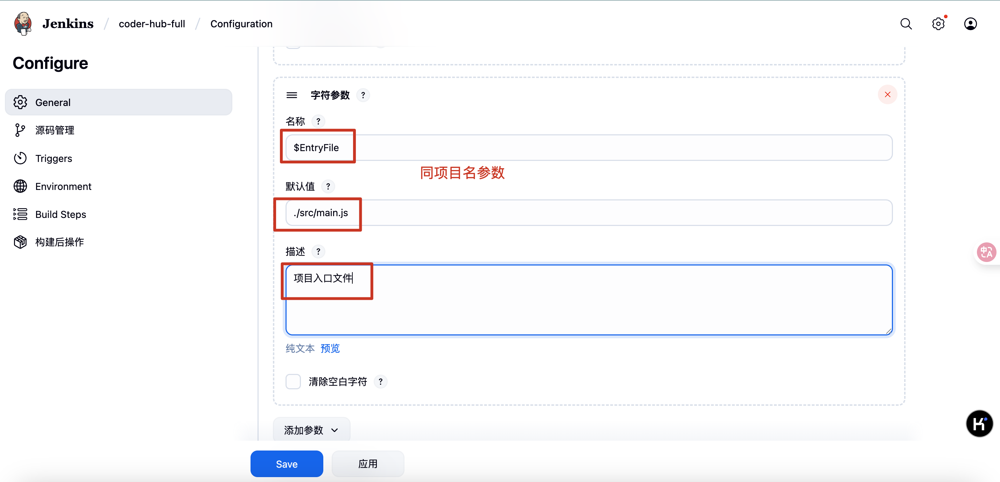
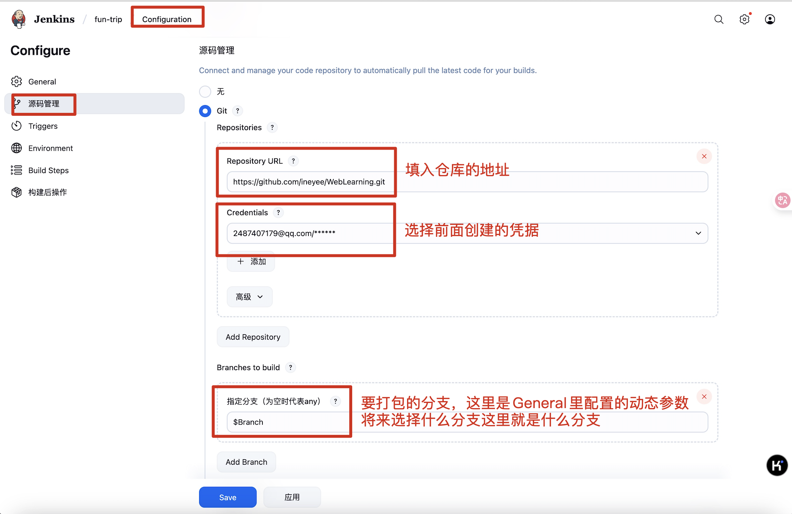
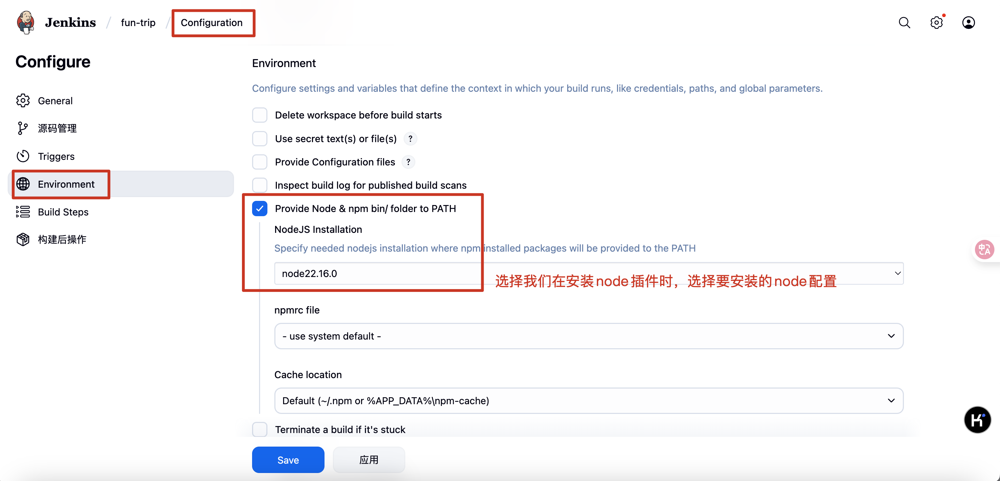
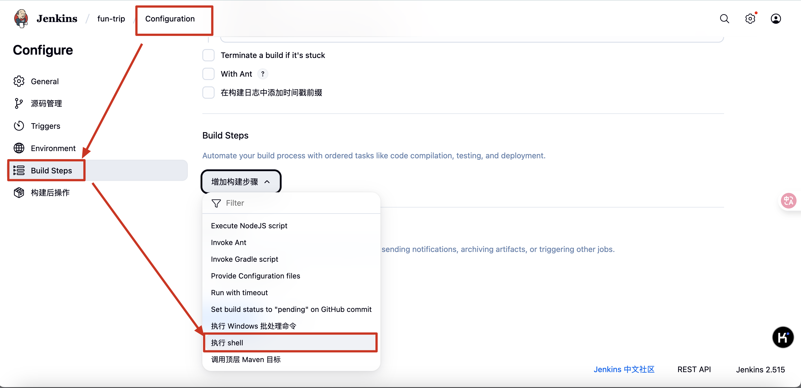
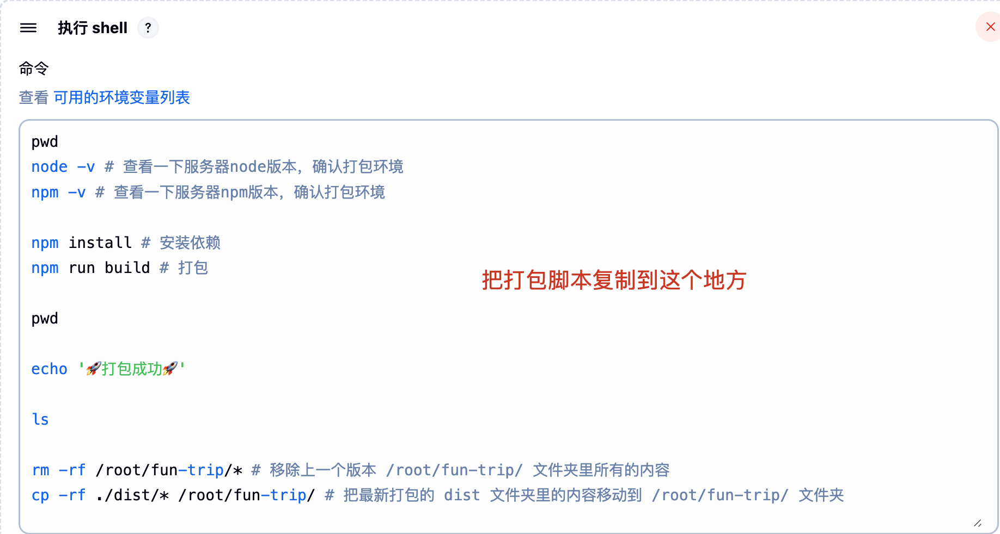

## 部署

#### 1、购买云服务器（这里以阿里云为例）

###### 1.1 注册阿里云账号
在阿里云官网注册即可，https://aliyun.com/

###### 1.2 购买云服务器
* 阿里云首页
* 控制台
* 搜索云服务器ECS，点进去
* 创建实例（一个实例对应一个服务器）
  * 基础配置
    * 付费模式：长期使用选包年包月，学习练习选按量付费
    * 地域及可用区：阿里的服务器放在很多不同的地方，我们要选择离用户近的那个地方以便用户访问起来更快
    * 实例规格：服务器的核数和内存要多少，按自己的需求选择相应性能的规格
    * 镜像操作系统：服务器一般安装的都是Linux操作系统，公司里我们一般选择的是Linux操作系统的CentOS版本
    * 存储：服务器的硬盘要多大，按自己的需求选择相应的存储容量
  * 网络和安全组：选择默认的或之前的安全组或新建一个安全组都行，主要决定了哪些端口号可以被访问，比如安全组要添加上80端口和443端口，因为http请求默认是80端口，https请求默认是443端口，所以我们要添加上这两个端口，这样我们的服务器才能被外网访问，又比如MySQL数据库默认的端口是3306端口，所以我们也要添加上这个端口，否则我们的数据库也不能被外网访问
  * 密钥对或密码：选择自定义密码，输入密码，就是root这个用户的密码，将来我们可以通过这个账号和密码来访问服务器
  
#### 2、配置云服务器，给服务器安装node和mysql

###### 2.1 先把我们的电脑连接到服务器
* 阿里云的实例（即服务器）详情页面里有个“远程连接”，点击它即可连接上服务器

###### 2.2 在阿里云给我们打开的终端里给服务器安装node和mysql
* 执行“dnf install nodejs”命令安装nodejs（建议服务器上的 node 版本跟本机 node 版本一致，不然容易本地项目能跑去来，但是服务器上的项目跑不起来）
* 可以通过“node -v”或“node --version”来查看所安装nodejs的版本
* 执行“dnf install mysql-server”命令安装mysql
* 可以通过“mysql -V”或“mysql --version”来查看所安装mysql的版本

###### 2.3 在阿里云给我们打开的终端里启动mysql
* 执行“systemctl start mysqld”命令来启动mysql
* 然后我们可以执行”systemctl status mysqld“命令来查看mysql的运行状态是否成功启动，如果看到active(running)就代表启动成功了
* 此外我们还可以执行”systemctl enable mysqld“命令来让服务器重启时自动启动mysql，免得每次重启系统还得我们主动执行命令来启动mysql

###### 2.4 在阿里云给我们打开的终端里配置mysql
执行“mysql_secure_installation”命令来配置mysql
* 选择 yes 来开是配置
* 选择给数据库设置强密码
* 设置数据库的密码，记下这个密码，将来我们在代码里连接数据库时要用到
* 选择 yes 来确认使用此密码
* 然后会让我们选择是否删除匿名用户，我们选择Y
* 然后会让我们选择是否禁止root用户远程登录，我们选择N
* 然后会让我们选择是否删除test数据库，我们选择Y
* 然后会让我们选择是否刷新权限表，我们选择Y

###### 2.5 在阿里云给我们打开的终端里修改数据库 root 用户的访问权限
* 执行“mysql -u root -p”命令来登录数据库，回车后会提示我们输入密码，输入前面我们给数据库设置的密码即可
* 登录成功后，执行“use mysql;”命令来切换到mysql数据库
* 执行“select host, user from user;”命令来查看当前数据库的用户列表，默认如下：
```
+-----------+------------------+
| host      | user             |
+-----------+------------------+
| localhost | mysql.infoschema |
| localhost | mysql.session    |
| localhost | mysql.sys        |
| localhost | root             |
+-----------+------------------+
```
* 可以看到有一行记录是这样的：“localhost root”，这代表root用户只能在当前服务器上来访问数据库，无法通过其它主机访问数据库，可是我们需要各个开发者通过他们电脑上Navicat来访问数据库，所以得把把“localhost”改成“%”（通配符），这样root用户可以从任意主机登录了
* 执行“update user set host='%' where user='root';”命令来修改root用户的访问权限 
* 再次执行“select host, user from user;”命令来再次查看用户列表，发现已经更新成功：
```
+-----------+------------------+
| host      | user             |
+-----------+------------------+
| localhost | mysql.infoschema |
| localhost | mysql.session    |
| localhost | mysql.sys        |
| %         | root             |
+-----------+------------------+
```
* 执行“flush privileges;”命令来刷新权限表，这样修改才会生效
* 执行“exit;”命令来退出数据库

#### 3、在 Navicat GUI 工具里连接服务器上的数据库
* 首先得确保网络和安全组里添加了3306端口，否则连接不上
* 其次得做好2.5 root用户的访问权限，否则连接不了
* 然后就可以去Navicat里连接服务器上的数据库了
  * 新建一个连接
  * 连接的类型选择为 MySQL
  * 输入连接的名字，如ali_mysql
  * 输入域名和端口号，如118.25.70.197、3306
  * 输入账号和密码，root、前面我们设置的数据库密码
  * 确定后连接就创建好了，此时连接是灰色，代表连接尚未启动
  * 双击这个连接就可以启动了，此时连接会变成绿色，这个连接下所有的数据库也会被展示出来
* 这样我们就可以在Navicat里操作服务器上的数据库了，比如创建表、查看表里的数据等等

#### 4、在 Navicat GUI 工具里做数据库迁移
比如项目刚开始我们的数据库是创建在自己电脑上的一个数据库，现在项目开发完了，本地数据库里已经有各种表结构及关连了，当然也有一些测试数据，现在要把本地这个数据库迁移到服务器上的数据库里，这件事情其实很简单，Navicat GUI 工具就可以帮我们完成
* 选中本地的数据库
* 右键选中“转储 SQL 文件”，选择“结构和数据”（表结构和测试数据）或“仅结构”（仅表结构），开始转储，等待下载完成
* 在远程服务器上创建一个跟本地同名的数据库
* 然后直接把下载好的 SQL 文件直接拖到远程数据库里，根据提示运行一下即可，这样一来，服务器上的数据库就跟本地的一模一样了

#### 5、把我们的项目部署到服务器

> `首先确保我们项目里的IP地址是云服务器的公网IP地址，否则接口请求不通`
>
> `其次确保我们项目里的端口号在云服务器的网络与安全组里添加了，否则接口请求不通`
>
> `最后确保数据库配置里的参数都是远程服务器的参数，否则接口请求不通`
>
> `无论手动部署还是自动部署，建议第一次部署时采用手动部署，因为手动部署的第一次部署必然是手动部署，而自动部署的第一次采用手动部署也可以避免后续自动部署时jenkins报各种文件夹和文件无法创建的问题`

###### 5.1 手动部署
* VSCode里安装”Remote -SSH“插件（也可以直接在阿里云的那个连接远程里做，那个里面也能打开文件夹）
* 左侧侧边栏选中该插件
* SSH右侧选择新建远程
* 在弹窗里输入“ssh root@服务器的公网IP”，回车来新建远程
* 选择“/User/xxx/.ssh/config”配置文件
* 左侧SSH下就有我们的远程服务器了
* 选中远程服务器，右键连接，输入root用户的密码即可发起连接
* 连接成功后，选中左侧侧边栏的文件，发现里面会提示“已连接到远程”
* 然后我们选择“打开文件夹”来打开远程服务器上的文件夹，默认会帮我们打开远程服务器的root文件夹，这样远程服务器的root文件夹就展示在VSCode里了
* 直接把我们的项目拖进root文件夹里，这样远程服务器上就有我们的项目了
* 打开终端，此时的终端默认就是操作远程服务器
* cd 到服务器上我们那份项目的根目录
  * 执行“npm install”来安装项目依赖的三方库（因为我们可能 gitignore 了三方库的源文件），要把这些三方库安装到服务器上，就像我们本机电脑上有这些三方库一样
  * 执行“pm2 start ./src/main.js --name coder-hub-full”来启动项目
* 去请求接口试试吧

## 附录：pm2 工具

我们可以在服务器终端使用“node|nodemon 我们项目的入口文件”或“npm run start”之类的命令来启动项目，但是这样启动的项目会在我们终端关闭后就停止运行，用户就无法继续访问我们的项目了，所以实际开发中我们都是用 pm2（process manager） 来管理我们项目进程的启动与停止，它就会确保终端关闭后项目还一直在服务器上跑

在终端里全局安装 pm2：

```shell
npm install pm2 -g
```

pm2 常用的命令：

```shell
# 查看 pm2 的安装版本
pm2 -v
pm2 --version

# 启动进程并给进程起个名字
pm2 start 项目入口文件 --name 进程的名字

# 显示所有进程状态
pm2 list

# 停止指定的进程（进程停止，但是还会存储在 list 里）
pm2 stop 进程的 id
# 停止所有进程（进程停止，但是还会存储在 list 里）
pm2 stop all

# 重启指定的进程
pm2 restart 进程的 id
# 重启所有进程
pm2 restart all

# 杀死指定的进程（进程杀死，不会存储在 list 里）
pm2 delete 进程的 id
# 杀死全部进程（进程杀死，不会存储在 list 里）
pm2 delete all

# 我们的项目同时跑几个进程，以便高并发时实现负载均衡
pm2 start 项目入口文件 -i 几个进程 --name 所有进程的名字
```

###### 3.2 Jenkins自动部署

###### 3.2.1 在阿里云给我们打开的终端里给服务器安装Java环境

Jenkins本身是依赖Java的，所以我们需要先安装Java环境：

* 执行“dnf search java”命令来查看支持的java版本，选择一个版本比如“java-21-openjdk”
* 执行“dnf install java-21-openjdk”命令安装java
* 可以通过“java --version”来查看所安装java的版本

###### 3.2.2 在阿里云给我们打开的终端里给服务器安装Jenkins及其插件

因为Jenkins本身是没有在dnf的软件仓库包中的，所以我们需要通过Jenkins仓库来安装：

* wget是Linux中下载文件的一个工具，-O表示输出到某个文件夹并且命名为什么文件
* rpm：是Linux下一个软件包管理器

```shell
# 把Jenkins仓库文件先下载到服务器的某个目录下
wget –O /etc/yum.repos.d/jenkins.repo http://pkg.jenkins-ci.org/redhat-stable/jenkins.repo

# 导入GPG密钥以确保安装的jenkins软件合法
sudo rpm --import https://pkg.jenkins.io/redhat-stable/jenkins.io.key
# 或者
rpm --import http://pkg.jenkins-ci.org/redhat/jenkins-ci.org.key
```

直接找到“/etc/yum.repos.d/jenkins.repo”这个仓库文件或通过“vim /etc/yum.repos.d/jenkins.repo”把下面的内容复制进仓库文件里

```
[jenkins]

name=Jenkins-stable

baseurl=http://pkg.jenkins.io/redhat

gpgcheck=1
```

安装Jenkins

```shell
dnf install jenkins # --nogpgcheck(可以不加)
```

启动Jenkins的服务：

```shell
systemctl start jenkins
systemctl status jenkins
systemctl enable jenkins
```

因为Jenkins默认使用服务器的8080端口提供服务，所以需要在云服务器的网络和安全组里添加8080端口。添加好端口后，此时去浏览器里通过云服务器的ip地址加端口号就能访问到jenkins的服务了，比如：http://118.25.70.197:8080

访问地址后，Jenkins会提示我们登录，并且告诉我们admin用户的初始密码存储在云服务器上的哪个文件里，我们可以找到这个文件拿到密码，或者通过下面的cat命令直接读取文件拿到密码，然后登录进去：

```shell
cat /var/lib/jenkins/secrets/initialAdminPassword # 读取文件里的密码
```

登录成功后选择“安装推荐的插件”，这样一来jenkins在执行大多数操作时所需要的插件就被安装好了

当然也有一些插件需要我们后续手动安装——比如node，一会进去之后记得手动安装一下node插件：【管理jenkins】-【插件】-【可用的插件】-【搜索node】-【安装nodejs】。安装好nodejs插件之后，还得去【全局工具配置】-【NodeJS 安装】-【新增NodeJS】-【别名随便取一个比如叫node】-【要安装的node版本号最好跟你电脑上开发用的那个版本号一致，不然可能因为api不一致，本地代码能跑服务器上就不能跑了】-【其他的不用管】-【保存】（这里其实是让jenkins 给服务器安装一个node，如果我们服务器上已经安装相同版本的话就不用安装了）

插件安装成功后，jenkins会提示我们创建管理员用户以便后续使用，因为刚才默认的admin用户密码太难记了，所以我们一般都是用自己创建的用户来使用jenkins，按提示创建用户并登录进去即可

###### 3.2.3 在阿里云给我们打开的终端里配置jenkins

执行下面的命令让jenkins具备root权限，到时候jenkins访问我们服务器上的资源时就是以root权限访问了，执行完后记得重启一下jenkins

```shell
sudo usermod -a -G root jenkins
systemctl restart jenkins
```

如果执行了上面的命令，在打包时还是遇到无法删除原项目的权限问题，可以再执行下下面的命令，执行完后记得重启一下jenkins

```shell
sudo chown -R jenkins /root/coder-hub-full #替换成项目的真实目录
systemctl restart jenkins
```

###### 3.2.4 在阿里云给我们打开的终端里给服务器安装git
因为将来jenkins要通过git来拉取我们提交的代码到服务器上
* 执行“dnf install git”命令安装git
* 可以通过“git -v”或“git --version”来查看所安装nginx的版本

###### 3.2.5 新建打包任务、完成自动打包与部署

* `新建任务`

新建 item 和 create a job 是一样的，都是新建一个任务



输入任务名、选择自定义打包流程、点击确定



* `General -> 参数化构建过程 -> 添加参数`








* `源码管理`

先创建一个凭据：【管理jenkins】-【凭据管理】-【System】-【全局凭据】-【添加凭据】- 输入你git仓库的账号和密码



* `构建环境`



* `Build Steps`




打包脚本
```shell
export PM2_HOME=/root/.pm2 # 这句用来确保 pm2 用的是全局安装的那个，而不是jenkins环境下的那个

pwd # 检查当前所在目录，应该都是在jenkins目录下

node -v # 检查打包环境，查看一下服务器node版本
npm -v # 检查打包环境，查看一下服务器npm版本

npm install # 安装依赖

rm -rf /root/$ProjectName/* # 移除上一个版本 /root/coder-hub-full/ 文件夹里所有的内容
cp -rf ./* /root/$ProjectName/ # 把jenkins目录下最新的全部文件移动到 /root/coder-hub-full/ 文件夹

cd /root/$ProjectName/
pm2 delete $ProjectName
pm2 start $EntryFile --name $ProjectName # 重启 Node.js 服务或初次部署时启动服务

echo '🚀 部署完成 🚀'
```


